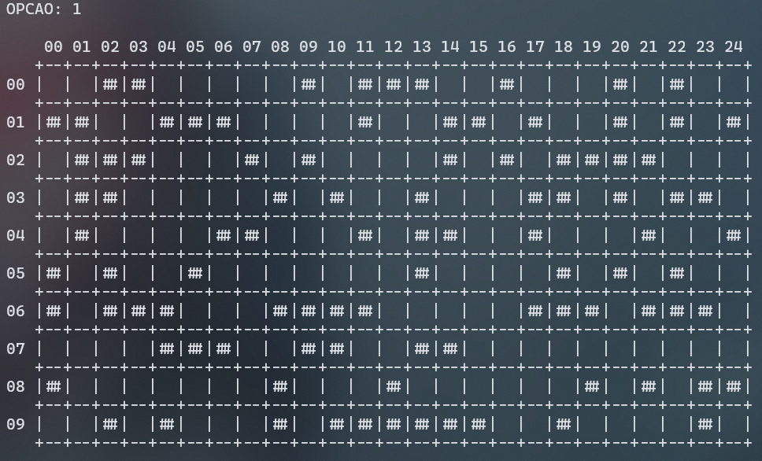
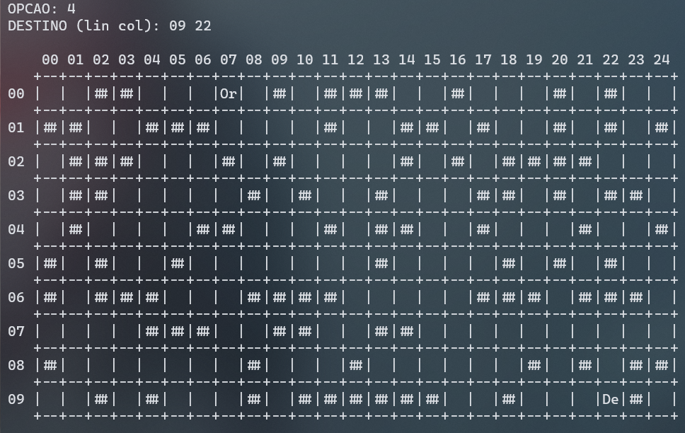

# Labirinto

Objetivo: Encontrar o caminho mais curto por meio do algoritimo A*


## Algoritmo A*
O A* é um algoritmo de busca informado (best-first search), formulado para grafos ponderados. Seu objetivo é encontrar o caminho de menor custo entre um nó inicial e um nó objetivo.

### Funcionamento

* Início: Parte de um nó inicial e mantém uma árvore de caminhos.
* Extensão de Caminhos: Em cada iteração, decide qual caminho estender com base no custo atual e em uma estimativa do custo até o objetivo.
* Função de Custo: Seleciona o caminho que minimiza 
𝑓(𝑛)= 𝑔(𝑛) + ℎ(𝑛), onde:
  * 𝑔(𝑛) é o custo do caminho do nó inicial até 𝑛


  * ℎ(𝑛) é uma estimativa heurística do custo de 
𝑛
n até o objetivo.

### Critério de Término

* O algoritmo termina quando encontra um caminho do nó inicial ao objetivo ou quando não há mais caminhos a serem estendidos.
* Se a heurística ℎ for admissível (não superestima o custo real), A* garante encontrar o caminho de menor custo.

### Implementação 

* <strong>Fila de Prioridade </strong>: Utiliza uma fila de prioridade para selecionar repetidamente os nós de menor custo estimado para expansão, conhecida como conjunto aberto, franja ou fronteira.

* <strong>Processo</strong>: 
  * O nó com o menor valor 𝑓 é removido da fila.
  * Atualiza os valores 𝑓 e 𝑔 dos vizinhos desse nó.
  * Adiciona os vizinhos à fila.
  * Continua até que um nó removido seja o nó objetivo.

## Saída 🚀 

### Menu

```bash
+------------+
| MAPA VAZIO |
+------------+

1 - Gerar mapa 
2 - Ler mapa 
3 - Definir origem 
4 - Definir destino 
5 - calcular caminho 
0 - Sair
OPCAO:
```
### Gerar mapa

Cria um mapa aleatório de tamanho 25x10



### Define inicio do caminho


### Define fim do caminho



### Final
Calcula a menor distância percorrida caso tenha um destino válido, mostra a quantidade de números de nós abertos e fechados que foram usado e também exibe o comprimento do trajeto e o tempo que levou para encontrá-lo.


